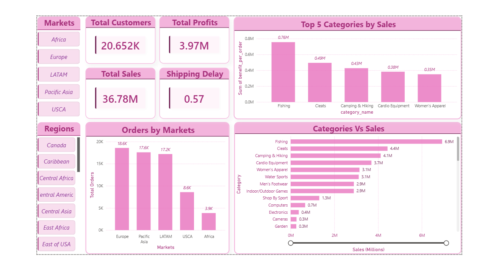
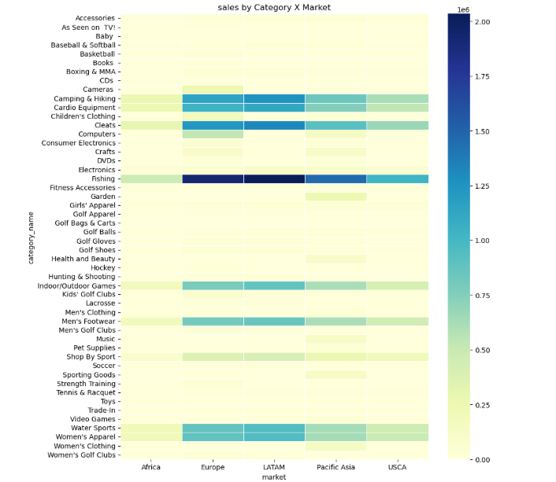
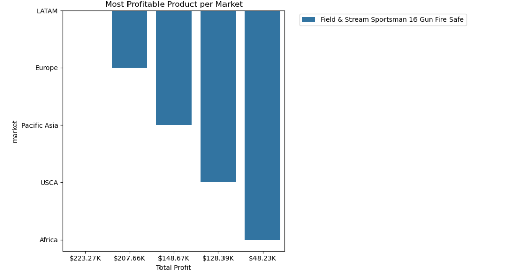
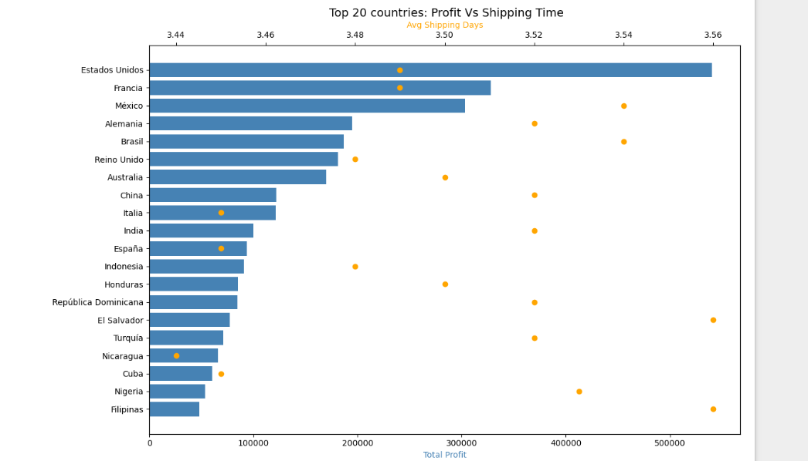
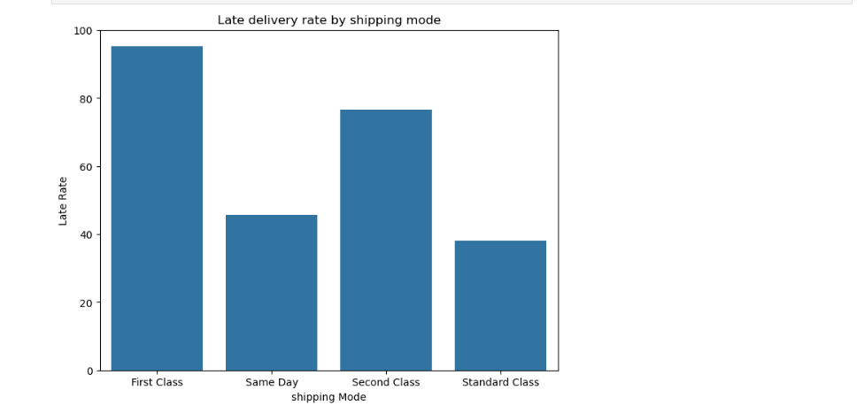

# 📦 Supply Chain Data Analytics | Python, SQL & Power BI

## 📌 Project Overview

This project presents an end-to-end Supply Chain Data Analytics solution using **Python**, **PostgreSQL**, and **Power BI**. The objective is to analyze a global retail supply chain dataset to uncover actionable business insights related to sales performance, profitability, customer behavior, and delivery efficiency.

The project follows a complete analytics workflow—from data cleaning and exploratory data analysis (EDA) to SQL integration and an interactive Power BI dashboard.

---

## 🎯 Objectives

- Analyze sales and profitability across markets and product categories.
- Evaluate delivery performance and shipping efficiency.
- Identify operational bottlenecks in the supply chain.
- Understand customer purchasing behavior.
- Build an interactive dashboard for business decision-making.

---

## 🛠 Tech Stack

- **Python**
  - Pandas
  - NumPy
  - Matplotlib
  - Seaborn
  - Plotly

- **Database**
  - PostgreSQL
  - SQL

- **Visualization**
  - Microsoft Power BI

---

## 📂 Repository Structure

```
Supply-Chain-Analytics/
│
├── data/
│   ├── SupplychainDataset.csv
│   ├── supply_chain_cleaned.csv
│   └── supply_chain_final.csv
|   └── DescriptionDataCoSupplyChain (2).csv
│
├── notebooks/
│   ├── Data_Cleaning.ipynb
│   ├── Exploratory_Data_Analysis.ipynb
|
│
├── powerbi/
│   └── Supply_Chain_Dashboard.pbix
│
├── images/
│   ├── dashboard.png
│   ├── country wise sales distribution.png
│   ├── Sales by category and Market.png
|   ├── Most Profitable Product across Market.pngg
|   ├── Top 20 Countries vs Shipping Time.png
│   └── Late Delivery By Shiping Mode.png
│
└── README.md
```

---
## Data Cleaning
- checked for every dataframe and corrected them
- Dropped un-useful columns
- Checked for null values
- connected the cleaned csv file with Postgres SQL database

## 📊 Exploratory Data Analysis

### 1. Category-wise Sales Analysis
- Calculated total sales for every product category.
- Identified top-performing categories based on revenue.

---

### 2. Country-wise Performance
Analyzed:

- Total Sales
- Total Profit
- Average Profit
- Average Shipping Time
- Total Orders

Countries with negative overall profit were excluded from profitability analysis.

---

### 3. Market-wise Late Delivery Analysis

Computed:

- Total Orders
- Late Orders
- Late Delivery Rate (%)

**Key Insight**

- Late delivery rate remained around **54–55%** across all markets.
- Indicates that delivery delays are a global operational issue rather than a market-specific problem.

---

### 4. Shipping Mode Analysis

Compared shipping modes using:

- Average Scheduled Shipping Days
- Average Actual Shipping Days
- Shipping Gap
- Late Delivery Rate

**Key Insight**

First Class shipping exhibited the highest percentage of late deliveries despite having shorter delivery durations.

---

### 5. Market × Category Analysis

Determined the highest-selling category within every market.

**Key Insight**

Fishing products consistently generated the highest sales across multiple global markets.

---

### 6. Profitability vs Delivery Performance

Performed statistical hypothesis testing comparing:

- Late Orders
- On-time Orders

**Result**

No statistically significant difference was observed in average profit per order between late and on-time deliveries.

---

### 7. Customer Analysis

Created customer-level metrics including:

- Total Orders
- Total Profit
- Average Shipping Time

Focused on repeat customers to understand purchasing behavior.

---

## 📈 Power BI Dashboard

The interactive dashboard includes:

### Cards

- Total Sales
- Total Profit
- Total Customers
- Shipping Delay

### Visualizations

- Top Profitable Categories
- Orders Across Markets
- Sales vs Category
- Interactive Market Filters
- Region Filters

Example:






images/Late Delivery By Shiping Mode.png


The dashboard enables users to analyze sales performance dynamically across multiple business dimensions.

---

## 📌 Key Business Insights

- Fishing products dominate sales across most global markets.
- Delivery delays consistently affect over half of all shipments.
- First Class shipping records the highest delay percentage.
- Profitability remains relatively stable regardless of delivery delays.
- Europe and Pacific Asia generate the highest order volumes.
- Customer purchasing behavior is concentrated among a relatively small group of repeat buyers.

---

## 🚀 Future Improvements

- Demand forecasting using Machine Learning.
- Customer segmentation (RFM Analysis).
- Inventory optimization.
- Predictive delivery delay model.
- Interactive forecasting dashboard.

---

## 📷 Dashboard Preview

```
images/Dashboard.png
```

---

## ▶️ How to Run

### Clone the repository

```bash
git clone https://https://github.com/Devshadow-ui/Supply-Chain-analysis/.git
```

### Open

- Jupyter Notebooks
- PostgreSQL Database
- Power BI Dashboard (.pbix)

---

## 👤 Author

**Ruchir Saraf**

LinkedIn: *(https://www.linkedin.com/in/ruchirsaraf/)*

GitHub: *(https://github.com/Devshadow-ui)*

---

## ⭐ If you found this project useful, consider giving it a Star.
